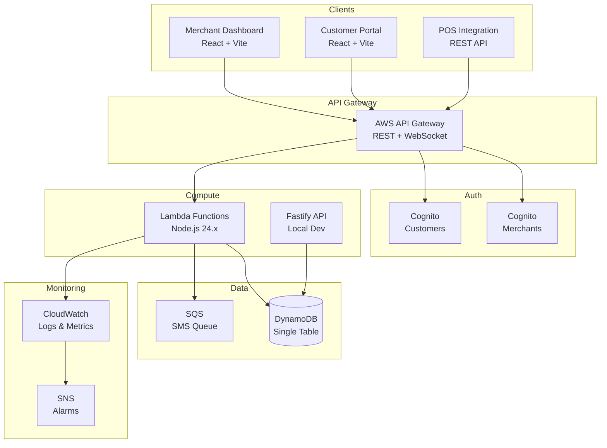
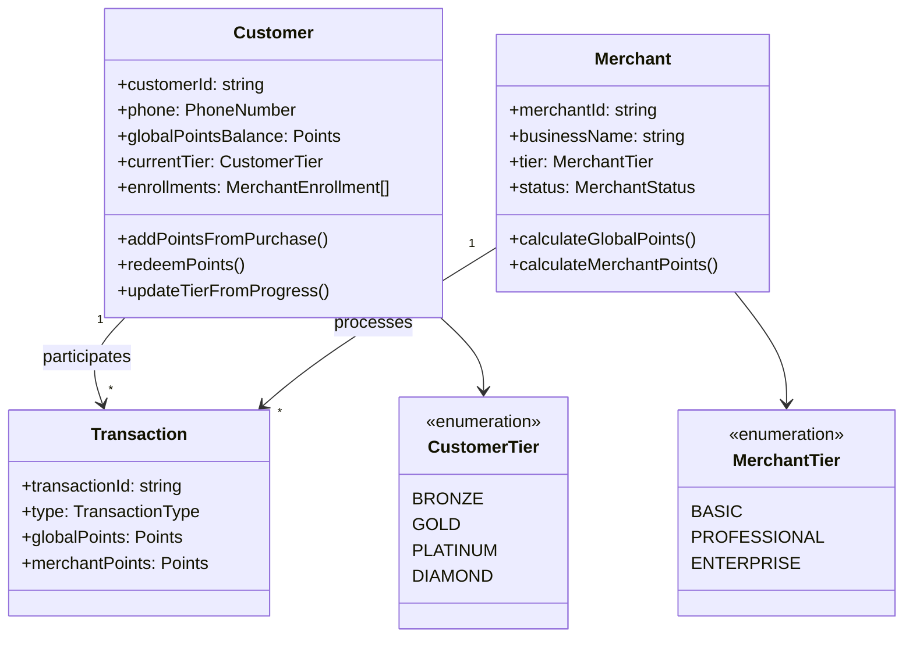

# Pointly

A multi-tenant SaaS loyalty platform for the Saudi Arabian market. Pointly enables merchants to run loyalty programs while customers earn and redeem points across a unified network.

## Architecture Overview



## Domain Model



## Quick Start

### Prerequisites

- Node.js 20+
- pnpm 10+
- Docker & Docker Compose

### Local Development

```bash
# Clone the repository
git clone https://github.com/MohammadYusif/pointly.git
cd pointly

# Install dependencies
pnpm install

# Start local DynamoDB
pnpm docker:up

# Run the API in development mode
pnpm dev

# Run tests
pnpm test
```

### Environment Variables

Create `.env` files in each app directory. See component READMEs for details.

## Project Structure

```
pointly/
├── apps/
│   ├── api/                    # Core API service (Fastify + DDD)
│   ├── customer-portal/        # Customer-facing web app (React)
│   └── merchant-dashboard/     # Merchant admin panel (React)
├── packages/
│   ├── infrastructure/         # AWS CDK stacks
│   └── shared/                 # Shared types and utilities
├── docker/                     # Docker Compose for local dev
└── docs/                       # Additional documentation
```

| Directory | Description |
|-----------|-------------|
| `apps/api` | Core backend API with domain-driven design, handles all business logic |
| `apps/customer-portal` | React SPA for customers to view points, tiers, and redeem rewards |
| `apps/merchant-dashboard` | React SPA for merchants to manage loyalty programs and view analytics |
| `packages/infrastructure` | AWS CDK stacks for DynamoDB, Cognito, API Gateway, Lambda |
| `packages/shared` | Shared TypeScript types and utilities across packages |
| `docker/` | Local development services (DynamoDB Local, Admin UI) |

## Key Features

### Points System
- **Dual Currency**: Global points (network-wide) + Merchant points (store-specific)
- **Simplified Earning**: 1 SAR = 1 point for all merchant tiers
- **Decay System**: 12-month grace period (no decay), then Phase 1 (5%/month, months 12–17) and Phase 2 (15%/month, months 18+). Gold, Platinum, and Diamond customers are decay-immune.

### Customer Tiers
| Tier | Monthly Points | Earning Multiplier | Decay |
|------|---------------|-------------------|-------|
| Bronze | 0 – 4,999 | 1.0x | Yes |
| Gold | 5,000 – 9,999 | 1.1x | Immune |
| Platinum | 10,000 – 14,999 | 1.15x | Immune |
| Diamond | 15,000+ | 1.2x | Immune |

Tiers are evaluated monthly based on points earned in the current calendar month. Progress resets lazily on the first transaction of the new month.

### Merchant Tiers
| Tier | Price | Points Rate | Min Purchase | Welcome Bonus | Locations | SMS/month | Min Redemption |
|------|-------|-------------|--------------|---------------|-----------|-----------|----------------|
| Basic | 75 SAR/mo | 1 pt/SAR | 10 SAR | 50 pts | 1 | 100 | 100 pts |
| Professional | 105 SAR/mo | 1 pt/SAR | 5 SAR | 100 pts | 3 | 500 | 50 pts |
| Enterprise | 175 SAR/mo | 1 pt/SAR | None | 200 pts | Unlimited | 2,000 | 25 pts |

All tiers use a fixed redemption rate of 0.01 SAR per point.

## Scripts

| Command | Description |
|---------|-------------|
| `pnpm dev` | Start all services in development mode |
| `pnpm build` | Build all packages |
| `pnpm test` | Run all tests |
| `pnpm lint` | Lint all packages with Biome |
| `pnpm type-check` | TypeScript type checking |
| `pnpm docker:up` | Start local DynamoDB |
| `pnpm docker:down` | Stop local DynamoDB |
| `pnpm infra:deploy` | Deploy AWS infrastructure |

## Component Documentation

- [API Service](apps/api/README.md) - Core backend with domain-driven design
- [Infrastructure](packages/infrastructure/README.md) - AWS CDK deployment
- [Customer Portal](apps/customer-portal/README.md) - Customer web application
- [Merchant Dashboard](apps/merchant-dashboard/README.md) - Merchant admin panel

## Tech Stack

- **Runtime**: Node.js 24.x
- **Language**: TypeScript 5.7
- **API Framework**: Fastify 5
- **Database**: DynamoDB (single-table design)
- **Auth**: AWS Cognito
- **Infrastructure**: AWS CDK
- **Testing**: Vitest
- **Linting**: Biome
- **Monorepo**: Turborepo + pnpm

## License

Proprietary - All rights reserved
