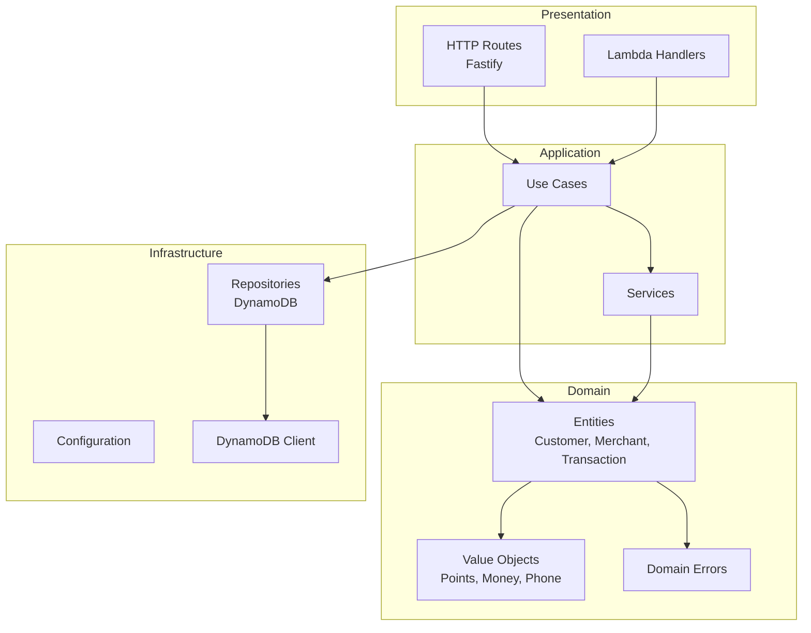

# Pointly API

Core backend service for the Pointly loyalty platform, built with Domain-Driven Design principles.

## Architecture



## Directory Structure

```
src/
├── domain/                    # Core business logic (no external dependencies)
│   ├── entities/              # Domain entities (Customer, Merchant, Transaction)
│   ├── value-objects/         # Immutable value types (Points, Money, PhoneNumber)
│   ├── errors/                # Domain-specific errors
│   └── __tests__/             # Domain unit tests
├── application/               # Use cases and orchestration
│   ├── use-cases/             # Business operations (RecordPurchase, RedeemPoints)
│   ├── repositories/          # Repository interfaces
│   ├── services/              # Service interfaces (Idempotency, Decay)
│   └── __tests__/             # Use case tests
├── infrastructure/            # External concerns
│   ├── config/                # Environment configuration
│   └── database/              # DynamoDB client setup
├── presentation/              # HTTP/Lambda handlers
│   └── http/                  # Fastify routes
└── shared/                    # Cross-cutting utilities
```

## Domain Entities

### Customer
- Manages global and merchant-specific point balances
- Tracks tier status (Bronze, Platinum, Diamond)
- Handles enrollment and consent per merchant
- Implements decay tracking for inactive accounts

### Merchant
- Defines loyalty program parameters
- Tiers: Basic, Professional, Enterprise
- Simplified points: 1 SAR = 1 point for all tiers

### Transaction
- Records all point movements
- Types: EARN, REDEEM, ADJUSTMENT, EXPIRATION, TRANSFER
- Immutable audit trail

## Use Cases

| Use Case | Description |
|----------|-------------|
| `EnrollCustomerUseCase` | Enroll a customer with a merchant, apply welcome bonus |
| `RecordPurchaseUseCase` | Process a purchase, award dual points |
| `RedeemPointsUseCase` | Redeem global points with tier multiplier |
| `ProcessPointsDecayUseCase` | Monthly job to decay inactive points |
| `ProcessMonthlyTierResetUseCase` | Monthly tier evaluation and progress reset |

## Environment Variables

| Variable | Required | Description |
|----------|----------|-------------|
| `NODE_ENV` | No | `development`, `production`, `test` |
| `AWS_REGION` | No | AWS region (default: `me-south-1`) |
| `USER_LEDGER_TABLE` | Yes | DynamoDB table for user data |
| `TRANSACTION_TABLE` | Yes | DynamoDB table for transactions |
| `IDEMPOTENCY_TABLE` | Yes | DynamoDB table for idempotency |
| `QR_NONCE_TABLE` | Yes | DynamoDB table for QR nonces |
| `PENDING_CONSENTS_TABLE` | Yes | DynamoDB table for pending consents |
| `SMS_QUOTA_TABLE` | Yes | DynamoDB table for SMS quotas |
| `SMS_QUEUE_URL` | Yes | SQS queue URL for SMS notifications |
| `DYNAMODB_ENDPOINT` | No | Local DynamoDB endpoint for development |

### Local Development `.env`

```env
NODE_ENV=development
AWS_REGION=me-south-1
DYNAMODB_ENDPOINT=http://localhost:8000
USER_LEDGER_TABLE=Pointly-UserLedger-dev
TRANSACTION_TABLE=Pointly-TransactionAudit-dev
IDEMPOTENCY_TABLE=Pointly-Idempotency-dev
QR_NONCE_TABLE=Pointly-QRNonce-dev
PENDING_CONSENTS_TABLE=Pointly-PendingConsents-dev
SMS_QUOTA_TABLE=Pointly-SMSQuota-dev
SMS_QUEUE_URL=http://localhost:9324/queue/sms
```

## Scripts

| Command | Description |
|---------|-------------|
| `pnpm dev` | Start development server with hot reload |
| `pnpm build` | Compile TypeScript to JavaScript |
| `pnpm start` | Run compiled production build |
| `pnpm test` | Run tests once |
| `pnpm test:watch` | Run tests in watch mode |
| `pnpm test:coverage` | Run tests with coverage report |
| `pnpm lint` | Check code with Biome |
| `pnpm type-check` | TypeScript type checking |

## Running Locally

```bash
# From project root
pnpm docker:up          # Start DynamoDB Local

# From apps/api
pnpm dev                # Start API server at http://localhost:3000
```

## Testing

Tests are written with Vitest and follow the testing pyramid:

- **Domain tests**: Pure unit tests for entities and value objects
- **Use case tests**: Integration tests with mocked repositories
- **E2E tests**: Full API tests (planned)

```bash
# Run all tests
pnpm test

# Run with coverage
pnpm test:coverage

# Run in watch mode
pnpm test:watch
```

## API Endpoints (Planned)

| Method | Path | Description |
|--------|------|-------------|
| `GET` | `/v1/health` | Health check |
| `POST` | `/v1/purchases` | Record a purchase |
| `POST` | `/v1/redemptions` | Redeem points |
| `GET` | `/v1/customers/:id` | Get customer details |
| `GET` | `/v1/merchants/:id` | Get merchant details |

## Dependencies

| Package | Purpose |
|---------|---------|
| `fastify` | HTTP framework |
| `@aws-sdk/*` | AWS service clients |
| `zod` | Schema validation |
| `ulid` | Unique ID generation |
| `pino` | Structured logging |
