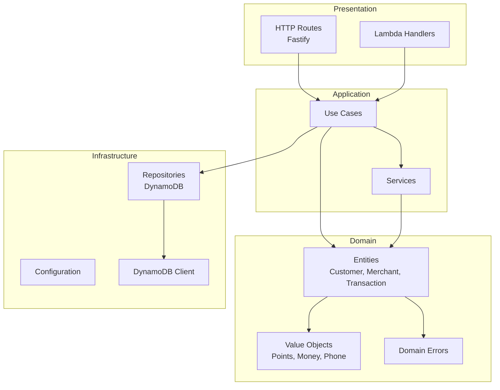

# Pointly API

Core backend service for the Pointly loyalty platform, built with Domain-Driven Design principles.

## Architecture



## Directory Structure

```
src/
├── domain/                    # Core business logic (no external dependencies)
│   ├── entities/              # Domain entities (Customer, Merchant, Transaction)
│   ├── value-objects/         # Immutable value types (Points, Money, PhoneNumber)
│   ├── errors/                # Domain-specific errors
│   └── __tests__/             # Domain unit tests
├── application/               # Use cases and orchestration
│   ├── use-cases/             # Business operations (RecordPurchase, RedeemPoints)
│   ├── repositories/          # Repository interfaces
│   ├── services/              # Service interfaces (Idempotency, Decay)
│   └── __tests__/             # Use case tests
├── infrastructure/            # External concerns
│   ├── config/                # Environment configuration
│   └── database/              # DynamoDB client setup
├── presentation/              # HTTP/Lambda handlers
│   └── http/                  # Fastify routes
└── shared/                    # Cross-cutting utilities
```

## Domain Entities

### Customer
- Manages global and merchant-specific point balances
- Tracks tier status (Bronze, Gold, Platinum, Diamond)
- Handles enrollment and consent per merchant
- Implements decay tracking for inactive accounts

### Merchant
- Defines loyalty program parameters
- Tiers: Basic, Professional, Enterprise
- Simplified points: 1 SAR = 1 point for all tiers

### Transaction
- Records all point movements
- Types: EARN, REDEEM, ADJUSTMENT, EXPIRATION, TRANSFER
- Immutable audit trail

## Use Cases

| Use Case | Description |
|----------|-------------|
| `EnrollCustomerUseCase` | Enroll a customer with a merchant, apply welcome bonus |
| `RecordPurchaseUseCase` | Process a purchase, award dual points |
| `RedeemPointsUseCase` | Redeem global points with tier multiplier |
| `ProcessPointsDecayUseCase` | Monthly job to decay inactive points |
| `ProcessMonthlyTierResetUseCase` | Monthly tier evaluation and progress reset |

## Environment Variables

| Variable | Required | Description |
|----------|----------|-------------|
| `NODE_ENV` | No | `development`, `production`, `test` |
| `AWS_REGION` | No | AWS region (default: `me-south-1`) |
| `USER_LEDGER_TABLE` | Yes | DynamoDB table for user data |
| `TRANSACTION_TABLE` | Yes | DynamoDB table for transactions |
| `IDEMPOTENCY_TABLE` | Yes | DynamoDB table for idempotency |
| `QR_NONCE_TABLE` | Yes | DynamoDB table for QR nonces |
| `PENDING_CONSENTS_TABLE` | Yes | DynamoDB table for pending consents |
| `SMS_QUOTA_TABLE` | Yes | DynamoDB table for SMS quotas |
| `SMS_QUEUE_URL` | Yes | SQS queue URL for SMS notifications |
| `DYNAMODB_ENDPOINT` | No | Local DynamoDB endpoint for development |

### Local Development `.env`

```env
NODE_ENV=development
AWS_REGION=me-south-1
DYNAMODB_ENDPOINT=http://localhost:8000
USER_LEDGER_TABLE=Pointly-UserLedger-dev
TRANSACTION_TABLE=Pointly-TransactionAudit-dev
IDEMPOTENCY_TABLE=Pointly-Idempotency-dev
QR_NONCE_TABLE=Pointly-QRNonce-dev
PENDING_CONSENTS_TABLE=Pointly-PendingConsents-dev
SMS_QUOTA_TABLE=Pointly-SMSQuota-dev
SMS_QUEUE_URL=http://localhost:9324/queue/sms
```

## Scripts

| Command | Description |
|---------|-------------|
| `pnpm dev` | Start development server with hot reload |
| `pnpm build` | Compile TypeScript to JavaScript |
| `pnpm start` | Run compiled production build |
| `pnpm test` | Run tests once |
| `pnpm test:watch` | Run tests in watch mode |
| `pnpm test:coverage` | Run tests with coverage report |
| `pnpm lint` | Check code with Biome |
| `pnpm type-check` | TypeScript type checking |

## Running Locally

```bash
# From project root
pnpm docker:up          # Start DynamoDB Local

# From apps/api
pnpm dev                # Start API server at http://localhost:3000
```

## Testing

Tests are written with Vitest and follow the testing pyramid:

- **Domain tests**: Pure unit tests for entities and value objects
- **Use case tests**: Integration tests with mocked repositories
- **E2E tests**: Full API tests (planned)

```bash
# Run all tests
pnpm test

# Run with coverage
pnpm test:coverage

# Run in watch mode
pnpm test:watch
```

## API Endpoints

All financial write routes are rate-limited to 30 req/min. Read-heavy routes (customer lists, analytics) allow 200 req/min. Health endpoints are exempt.

### Health
| Method | Path | Auth | Description |
|--------|------|------|-------------|
| `GET` | `/health` | None | Health check (legacy) |
| `GET` | `/v1/health` | None | Health check |

### Purchases (merchant auth required)
| Method | Path | Auth | Description |
|--------|------|------|-------------|
| `POST` | `/v1/purchases` | Merchant | Record purchase, award dual points. Returns `currentTier`, `tierUpgrade`, `earningMultiplier`, `isDecayImmune`, `pointsToNextTier`. |
| `POST` | `/v1/purchases/redeem` | Merchant | Smart-redeem: merchant points first, then global. Idempotent via `idempotencyKey`. |
| `GET` | `/v1/purchases/:transactionId` | Merchant | Fetch transaction details |

### Customers (merchant auth, scoped to caller's merchant)
| Method | Path | Auth | Description |
|--------|------|------|-------------|
| `GET` | `/v1/customers/:customerId` | Merchant | Get customer profile scoped to merchant |
| `GET` | `/v1/customers/phone/:phone` | Merchant | Look up customer by phone |
| `GET` | `/v1/customers/:customerId/transactions` | Merchant | Customer's transactions for this merchant |
| `GET` | `/v1/customers/:customerId/stats` | Merchant | Aggregate stats |

### Merchants (merchant auth, enforced ownership)
| Method | Path | Auth | Description |
|--------|------|------|-------------|
| `GET` | `/v1/merchants/:merchantId` | Merchant | Merchant profile + loyalty config |
| `PATCH` | `/v1/merchants/:merchantId` | Merchant | Update business profile |
| `GET` | `/v1/merchants/:merchantId/customers` | Merchant | Paginated customer list |
| `GET` | `/v1/merchants/:merchantId/transactions` | Merchant | Transaction history |
| `GET` | `/v1/merchants/:merchantId/stats` | Merchant | Aggregate stats |
| `GET` | `/v1/merchants/:merchantId/analytics` | Merchant | Time-series analytics |
| `GET` | `/v1/merchants/:merchantId/analytics/locations/:locationId` | Merchant | Per-location analytics |
| `POST` | `/v1/merchants/:merchantId/locations` | Merchant | Add location (Professional/Enterprise) |
| `GET` | `/v1/merchants/:merchantId/pending-consents` | Merchant | Customers awaiting consent |
| `PATCH` | `/v1/merchants/:merchantId/pending-consents/:customerId` | Merchant | Approve or deny consent |
| `GET` | `/v1/merchants/:merchantId/perks` | Merchant | List tier-gated perks |
| `POST` | `/v1/merchants/:merchantId/perks` | Merchant | Create perk |
| `PATCH` | `/v1/merchants/:merchantId/perks/:perkId` | Merchant | Update perk |
| `DELETE` | `/v1/merchants/:merchantId/perks/:perkId` | Merchant | Soft-delete perk |
| `POST` | `/v1/merchants/:merchantId/register-customer` | Merchant | Atomic find-or-create + enroll + grant consent. Applies `welcomeBonusApplied` on first enrollment. |
| `POST` | `/v1/merchants/:merchantId/enroll-customer` | Merchant | Enroll an existing customer |
| `POST` | `/v1/merchants/:merchantId/verify-qr` | Merchant | Verify customer QR nonce |

### Customer Self-Service (customer auth)
| Method | Path | Auth | Description |
|--------|------|------|-------------|
| `GET` | `/v1/me` | Customer | Own profile with global balance and tier |
| `PATCH` | `/v1/me` | Customer | Update display name |
| `GET` | `/v1/me/transactions` | Customer | Own transaction history |
| `POST` | `/v1/me/enroll` | Customer | Enroll at a merchant, triggers welcome bonus if eligible |
| `POST` | `/v1/me/qr-code` | Customer | Generate short-lived QR nonce for in-store use |
| `GET` | `/v1/me/perks` | Customer | All perks from enrolled merchants with tier unlock status |
| `POST` | `/v1/me/consent` | Customer | Grant or revoke merchant consent |

## Dependencies

| Package | Purpose |
|---------|---------|
| `fastify` | HTTP framework |
| `@aws-sdk/*` | AWS service clients |
| `zod` | Schema validation |
| `ulid` | Unique ID generation |
| `pino` | Structured logging |
