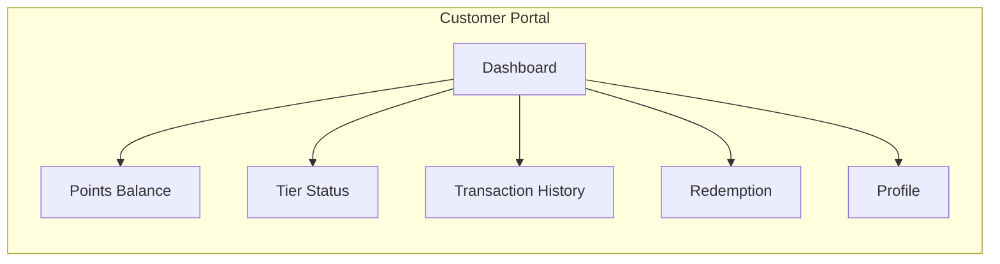

# Pointly Customer Portal

Customer-facing web application for viewing points, tier status, and redeeming rewards.

## Features (Planned)



### Dashboard
- Global points balance
- Current tier with progress bar
- Recent transactions
- Available rewards

### Points & Tiers
- View global and per-merchant balances
- Tier progress visualization
- Monthly earning summary
- Decay warnings for inactive accounts

### Redemption
- Browse available rewards
- Tier-based redemption multipliers
- QR code for in-store redemption
- Redemption history

### Profile
- Phone number (primary identifier)
- Notification preferences
- Enrolled merchants
- Consent management

## Tech Stack (Planned)

- **Framework**: React 18 + Vite
- **Styling**: Tailwind CSS
- **State**: TanStack Query
- **Auth**: AWS Amplify + Cognito
- **i18n**: Arabic (RTL) + English

## Getting Started

```bash
# Install dependencies
pnpm install

# Start development server
pnpm dev

# Build for production
pnpm build
```

## Environment Variables

```env
VITE_API_URL=http://localhost:3000
VITE_COGNITO_USER_POOL_ID=
VITE_COGNITO_CLIENT_ID=
VITE_REGION=me-south-1
```

## Directory Structure

```
src/
├── components/        # Reusable UI components
├── pages/            # Route pages
├── hooks/            # Custom React hooks
├── services/         # API client
├── stores/           # State management
└── utils/            # Utilities
```

## Design Considerations

- Mobile-first responsive design
- RTL support for Arabic
- Offline-capable PWA
- Accessibility (WCAG 2.1 AA)
