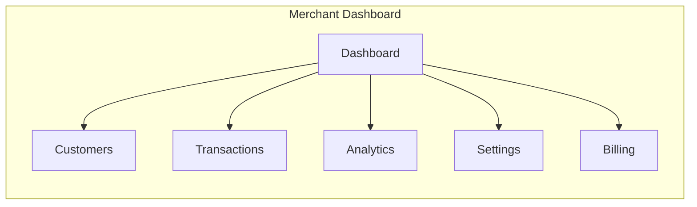

# Pointly Merchant Dashboard

Admin panel for merchants to manage their loyalty programs, view analytics, and process transactions.

## Features (Planned)



### Dashboard
- Today's transactions summary
- Points issued/redeemed
- Active customer count
- Revenue from loyalty program

### Customer Management
- Search customers by phone
- View customer point balances
- Issue manual adjustments
- Manage consent requests

### Transaction Processing
- Record new purchases
- Process redemptions
- View transaction history
- Export reports

### Analytics
- Points velocity charts
- Customer retention metrics
- Redemption rates
- Tier distribution

### Settings
- Business profile
- Loyalty program configuration
- Staff access management
- Notification preferences

### Billing (Enterprise)
- Subscription management
- Usage metrics
- Invoice history
- Payment methods

## Tech Stack (Planned)

- **Framework**: React 18 + Vite
- **UI Library**: shadcn/ui
- **Charts**: Recharts
- **Tables**: TanStack Table
- **Auth**: AWS Amplify + Cognito
- **Forms**: React Hook Form + Zod

## Getting Started

```bash
# Install dependencies
pnpm install

# Start development server
pnpm dev

# Build for production
pnpm build
```

## Environment Variables

```env
VITE_API_URL=http://localhost:3000
VITE_COGNITO_USER_POOL_ID=
VITE_COGNITO_CLIENT_ID=
VITE_REGION=me-south-1
```

## Directory Structure

```
src/
├── components/        # Reusable UI components
│   ├── ui/           # Base UI components (shadcn)
│   └── features/     # Feature-specific components
├── pages/            # Route pages
├── hooks/            # Custom React hooks
├── services/         # API client
├── stores/           # State management
└── utils/            # Utilities
```

## Role-Based Access

| Role | Permissions |
|------|-------------|
| Owner | Full access, billing, staff management |
| Manager | Transactions, customers, analytics |
| Cashier | Record purchases, process redemptions |

## POS Integration

Merchants can integrate with existing POS systems via:

- REST API with API keys
- Webhook notifications
- CSV batch import/export
