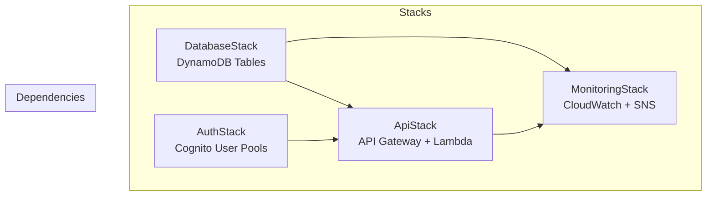

# Pointly Infrastructure

AWS CDK infrastructure-as-code for the Pointly platform. Deploys to AWS Bahrain region (me-south-1).

## Architecture



## Stacks

### DatabaseStack
DynamoDB tables with single-table design patterns.

| Table | Purpose | Keys |
|-------|---------|------|
| `UserLedger` | Customers, merchants, enrollments | PK, SK |
| `TransactionAudit` | All point transactions | PK, SK |
| `Idempotency` | Request deduplication | PK |
| `QRNonce` | QR code tracking | jti |
| `PendingConsents` | Ghost profiles | PK, SK |
| `SMSQuota` | SMS rate limiting | merchantId, month |
| `WalletPasses` | NFC wallet passes | PK, SK |

### AuthStack
Cognito user pools for authentication.

| Pool | Users | Auth Method |
|------|-------|-------------|
| Merchants | Business owners | Email + Phone |
| Customers | End users | Phone (SMS OTP) |

### ApiStack
API Gateway and Lambda functions.

- REST API with Cognito authorizers
- Lambda functions with DynamoDB access
- SQS queue for async SMS processing
- CORS enabled for web clients

### MonitoringStack
CloudWatch alarms and SNS notifications.

- API Gateway error rate and latency
- Lambda errors and throttles
- DynamoDB read/write throttles

## Prerequisites

- AWS CLI configured with credentials
- AWS CDK CLI installed (`npm install -g aws-cdk`)
- Node.js 20+

## Environment Setup

The infrastructure supports multiple environments:

| Environment | Stack Prefix | Removal Policy |
|-------------|--------------|----------------|
| `dev` | `Pointly-dev-*` | DESTROY |
| `staging` | `Pointly-staging-*` | DESTROY |
| `prod` | `Pointly-prod-*` | RETAIN |

## Deployment

```bash
# Bootstrap CDK (first time only)
cdk bootstrap aws://ACCOUNT_ID/me-south-1

# Deploy all stacks to dev
cdk deploy --all -c environment=dev

# Deploy specific stack
cdk deploy Pointly-dev-Database -c environment=dev

# Deploy to production
cdk deploy --all -c environment=prod

# Destroy dev environment
cdk destroy --all -c environment=dev
```

## Stack Outputs

After deployment, the following outputs are available:

| Output | Description |
|--------|-------------|
| `ApiUrl` | API Gateway endpoint URL |
| `MerchantUserPoolId` | Cognito pool ID for merchants |
| `CustomerUserPoolId` | Cognito pool ID for customers |
| `UserLedgerTableName` | DynamoDB table name |

## Directory Structure

```
packages/infrastructure/
├── bin/
│   └── pointly.ts          # CDK app entry point
├── lib/
│   └── stacks/
│       ├── DatabaseStack.ts    # DynamoDB tables
│       ├── AuthStack.ts        # Cognito pools
│       ├── ApiStack.ts         # API Gateway + Lambda
│       └── MonitoringStack.ts  # CloudWatch + SNS
├── cdk.json                # CDK configuration
└── package.json
```

## DynamoDB Access Patterns

### UserLedger Table

| Access Pattern | PK | SK |
|---------------|----|----|
| Get customer | `CUSTOMER#<id>` | `PROFILE` |
| Get merchant | `MERCHANT#<id>` | `PROFILE` |
| Customer enrollments | `CUSTOMER#<id>` | `ENROLLMENT#<merchantId>` |
| Customers by phone | GSI: `phone` | - |

### TransactionAudit Table

| Access Pattern | PK | SK |
|---------------|----|----|
| Get transaction | `TXN#<id>` | `<timestamp>` |
| Customer history | `CUSTOMER#<id>` | `TXN#<timestamp>` |
| Merchant transactions | GSI: `merchantId` | `createdAt` |

## Cost Considerations

- DynamoDB: Pay-per-request billing (no capacity planning)
- Lambda: First 1M requests free, then $0.20/1M
- API Gateway: $3.50 per million requests
- Cognito: First 50,000 MAU free

## Security

- All tables encrypted with AWS-managed keys
- Point-in-time recovery enabled for production
- VPC endpoints recommended for production
- Secrets stored in AWS Secrets Manager
